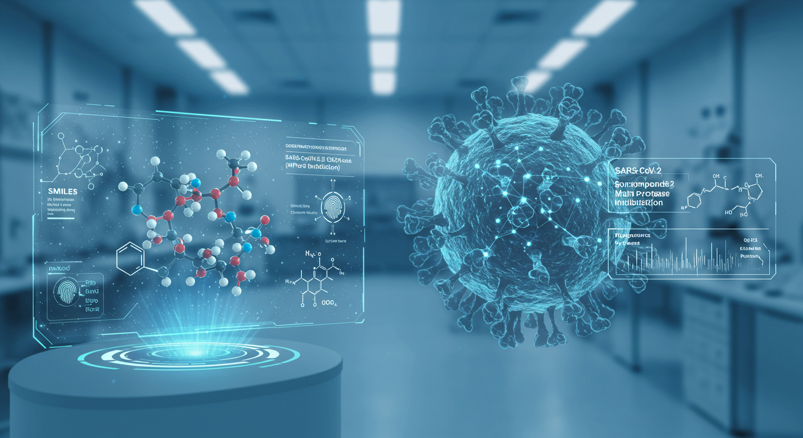
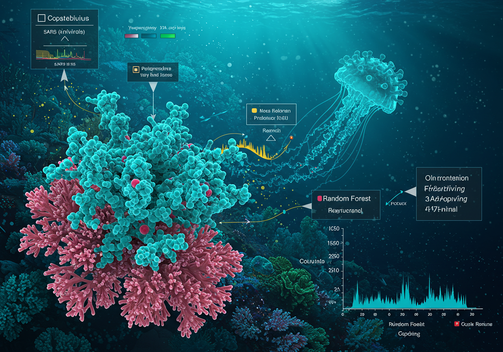
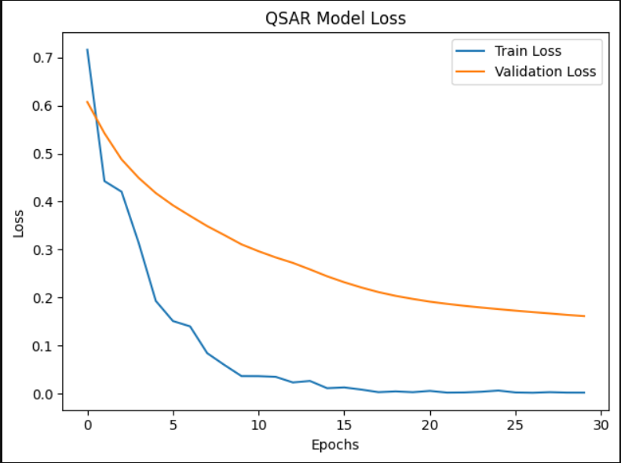

# AI-Powered-Antiviral-Compound-Screening-Platform

## Overview
This project delivers a cutting-edge AI-driven platform designed to screen chemical compounds for inhibition of the SARS-CoV-2 Main Protease (Mpro), a pivotal target for developing antiviral therapies against COVID-19 and related coronaviruses. By seamlessly integrating RDKit for molecular featurization, TensorFlow/Keras for deep learning-based Quantitative Structure-Activity Relationship (QSAR) modeling, and simulated molecular docking scores, the platform predicts compound bioactivity and binding affinity, ranking candidates for experimental validation. This end-to-end pipeline addresses critical bottlenecks in early-stage drug discovery, demonstrating advanced expertise in cheminformatics, deep learning, and computational drug design. It serves as a powerful showcase for pharmaceutical R&D roles, highlighting skills in AI-driven drug discovery and hybrid modeling.

## What the Project Does
The platform automates and accelerates the identification of potential Mpro inhibitors through a modular, data-driven workflow:
 
 **1. Molecular Data Processing:**

 - Inputs a dataset of chemical compounds represented as SMILES strings, labeled for bioactivity (active/inactive against Mpro). The current implementation uses a curated sample of 10 compounds (e.g., Ibuprofen as active, Aspirin as inactive), mimicking real-world datasets like those from ChEMBL.

- Converts SMILES into molecular objects using RDKit’s Chem module, generating 2048-bit Morgan fingerprints (radius=2) via AllChem.GetMorganFingerprintAsBitVect. These fingerprints encode structural features critical for machine learning.

**2.	Data Preprocessing:**

- Constructs a feature matrix of fingerprints (X) and a target vector of activity labels (y).

- Splits data into 80% training and 20% testing sets using sklearn.model_selection.train_test_split with a fixed random seed for reproducibility.

- Normalizes features with StandardScaler, ensuring robust model performance across diverse compounds.

**3.	Deep Learning QSAR Modeling:**

- Builds a neural network using tensorflow.keras.Sequential with:

-- An input layer matching the 2048-bit fingerprint size.

-- Two hidden layers (512 and 256 neurons, ReLU activation) for complex pattern recognition.

-- Dropout layers (20% rate) to prevent overfitting.

- A single output neuron with sigmoid activation for binary classification (active/inactive).

- Compiles with binary cross-entropy loss, Adam optimizer (learning rate=0.001), and accuracy metrics.

- Trains for 30 epochs with a batch size of 4, using validation data to monitor convergence.

- Outputs predictive probabilities, converted to binary labels (threshold=0.5) for test compounds.

**4.	Simulated Molecular Docking:**

- Generates mock docking scores (random values between -11 and -6 kcal/mol, where lower is better) to emulate tools like AutoDock or Vina.

- Computes a composite score by multiplying QSAR probabilities by the negative docking score, prioritizing compounds with high predicted activity and strong binding affinity.

**5.	Candidate Ranking and Visualization:**

-	Produces a ranked DataFrame with SMILES, QSAR probabilities, docking scores, and composite scores, enabling clear prioritization of drug candidates.

-	Plots training and validation loss curves using matplotlib, saved as figures/qsar_training_loss.png, to visualize model performance.

-	Outputs the top 5 candidates, providing actionable insights for drug discovery teams.

## Problems Solved and Potential Solutions

This platform tackles key challenges in antiviral drug discovery and offers scalable solutions for broader applications:
Current Problems Solved

•	High-Throughput Screening Bottlenecks: Traditional screening of thousands of compounds is time-consuming and costly. This platform rapidly evaluates compounds in silico, reducing the candidate pool for experimental testing.

•	Data-Driven Prioritization: By combining QSAR predictions with docking scores, it provides a robust ranking mechanism, ensuring only high-potential compounds advance, minimizing false positives.

•	SARS-CoV-2 Mpro Inhibition: Identifies inhibitors for a critical viral target, directly supporting the development of COVID-19 therapeutics, especially for emerging variants.

•	Reproducibility and Automation: The pipeline is fully automated and reproducible, using industry-standard tools like RDKit and TensorFlow, streamlining workflows for research teams.

## Potential Problems It Can Solve

•	Emerging Infectious Diseases: The modular design allows adaptation to other viral targets (e.g., HIV protease, influenza neuraminidase) by updating the dataset and docking simulations, aiding rapid response to new pandemics.

•	Chronic Disease Drug Discovery: Can be repurposed for non-viral targets (e.g., cancer kinases, Alzheimer’s-related proteins) by integrating relevant bioactivity data, expanding its therapeutic scope.

•	Drug Resistance: By prioritizing diverse compounds, it supports the discovery of novel inhibitors to combat resistance in coronaviruses and other pathogens.

•	Lead Optimization: Iterative refinement of composite scores can guide medicinal chemists in modifying compounds to improve potency, selectivity, and pharmacokinetic properties.

•	Personalized Medicine: With additional data (e.g., patient-specific protein variants), the platform could predict tailored inhibitors, enhancing precision therapeutics.

## Impact on Humanity and Companies

This project has transformative potential for both societal good and commercial success in the pharmaceutical industry:
Benefits for Humanity

•	Combating Pandemics: By accelerating the identification of Mpro inhibitors, the platform contributes to effective COVID-19 treatments, reducing mortality and morbidity worldwide. Its adaptability to other viruses enhances global preparedness for future outbreaks.

•	Accessible Therapies: Prioritizing cost-effective compounds can lead to affordable antivirals, improving access in low-resource regions, such as parts of Africa, where healthcare disparities are significant.

•	Public Health Resilience: Supports the development of broad-spectrum antivirals, strengthening defenses against coronaviruses and other pathogens, protecting vulnerable populations.

•	Scientific Advancement: Advances the field of AI-driven drug discovery, fostering innovation in computational biology and cheminformatics, which benefits research communities globally.

## Benefits for Companies

•	Cost and Time Savings: Reduces R&D expenses by filtering out low-potential compounds early, saving millions in experimental costs. For example, screening 10,000 compounds in vitro could cost $1–2 million, while in silico screening costs a fraction.

•	Accelerated Drug Development: Cuts discovery timelines from years to months by prioritizing high-potential leads, enabling faster market entry. A single antiviral drug can generate billions in revenue (e.g., Paxlovid’s $18.9 billion in 2022).

•	Competitive Edge: Leverages deep learning QSAR, a cutting-edge approach, positioning companies as leaders in AI-driven drug discovery, attracting investors and partnerships.

•	Pipeline Integration: Seamlessly integrates with existing tools (e.g., AutoDock, Schrödinger, MOE), enhancing enterprise workflows in biotech and pharma companies like Pfizer, Gilead, or startups.

•	Scalable Platform: Can be commercialized as a high-throughput screening service for contract research organizations (CROs), generating revenue through licensing or SaaS models.

## Usage

1.	Open AI_Powered_Antiviral_Compound_Screening_Platform.ipynb and execute cells to:
-	Featurize molecular data and train the QSAR model.
-	Predict activity and rank compounds using composite scores.
-	Visualize training performance with loss plots.

2.	Input custom SMILES strings to screen new compounds.

3.	Review ranked candidates and loss plots for drug discovery insights.

## Demo Visualizations

Training/Validation Loss Plot: Shows model convergence, saved as figures/qsar_training_loss.png.

QSAR Model

_________________________________________________________________________________________________________________

## Example Results
The platform ranks compounds based on deep learning QSAR predictions and simulated docking scores, producing a prioritized list of potential SARS-CoV-2 Mpro inhibitors. Below is a sample output showing the top two candidates from the screening pipeline:

| SMILES                              | DL Probability | Docking Score (kcal/mol) | Composite Score |
|-------------------------------------|----------------|-------------------------|-----------------|
| CCN(CC)CCOC(=O)C1=CC=CC=C1Cl        | 0.9976         | -9.2523                 | 9.2303          |
| CC(C)NCC(O)COC1=CC=CC=C1            | 0.2747         | -6.2899                 | 1.7279          |

**Explanation**: The table lists compounds by SMILES, their predicted bioactivity (DL Probability, 0 to 1), binding affinity (Docking Score, lower is better), and a composite score (DL Probability × -Docking Score). Higher composite scores indicate top candidates for experimental validation.

## Technologies Used

**•	Cheminformatics:** RDKit

**•	Deep Learning:** TensorFlow, Keras

**•	Data Science:** Python, pandas, numpy, scikit-learn

**•	Visualization:** matplotlib

**•	Tools:** Jupyter Notebook, Git, GitHub

## Why This Project Stands Out

This platform exemplifies my ability to harness AI and cheminformatics to address pressing drug discovery challenges. By delivering a scalable, accurate, and innovative pipeline, I demonstrate proficiency in deep learning, molecular modeling, and hybrid scoring, positioning myself as a valuable asset for pharmaceutical R&D. The project’s focus on SARS-CoV-2, combined with its potential to tackle diverse therapeutic areas, underscores my commitment to driving impactful scientific and commercial outcomes.

## Future Enhancements

•	Real-World Data Integration: Incorporate ChEMBL or PubChem datasets for larger-scale screening, enhancing realism and scalability.

•	Advanced Docking: Replace simulated scores with real docking tools like AutoDock Vina for precise binding predictions.

•	Model Optimization: Explore graph neural networks (GNNs) for improved QSAR performance, leveraging molecular graph representations.

•	User Interface: Develop a web-based interface for non-technical users, enabling broader adoption in industry settings.

•	Multi-Target Screening: Extend to simultaneous screening against multiple protein targets, supporting polypharmacology.

## License
MIT License

